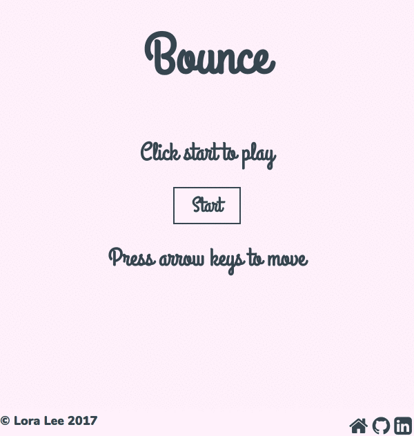

# Bounce

[Bounce live](http://loralee.life/bounce)



## Background

Bounce is a single-player game in which players juggle balls as they fall with increasing frequency. You can think about it as Brick Breaker without bricks. It was written in JavaScript and uses Canvas for 2D rendering.

## How to Play

Press the left and right arrow keys to move the paddle and juggle balls. Pick up bonus items along the way to either double your score or add a life. Try to keep the game going for as long as possible and see how high you can score! 

## Features

### 2D Rendering

All 2D rendering is done with HTML 5 Canvas. By looking at the positions of  the Canvas elements, I was able to detect all collisions between the balls and paddle.

```JavaScript
isCollidedWith(paddle) {
  const paddleStart = paddle.x;
  const paddleEnd = paddle.x + paddle.width;
  const ballPos = this.y + this.radius;

  return (ballPos >= 550 && ballPos <= 560) && (this.x >= paddleStart && this.x <= paddleEnd);
}
```

### Increasing difficulty

The game's difficulty is increased every 4 seconds. If `Math.random()` is less than or equal to the difficulty times a fraction, a new ball is added. This introduces an element of randomness and minimizes predictability. As the game's difficulty increases, the probability of adding a ball also increases.

### Calculating x-velocity on bounce

In order to ensure the ball lands toward the center of the paddle after each bounce, I use a physics equation to determine the time it takes for the ball to reach its apex, then calculate the x-velocity based on the calculated time and the distance I want the ball to travel.

```JavaScript
bounce() {
  this.dy = Ball.Y_VELS[Math.floor(Math.random() * 3)];
  const time = (this.dy * -1) / this.gravity;
  this.dx = 200 / (2 * time);

  const pop1 = new Audio('assets/sounds/pop1.wav');
  pop1.play();
}
```
