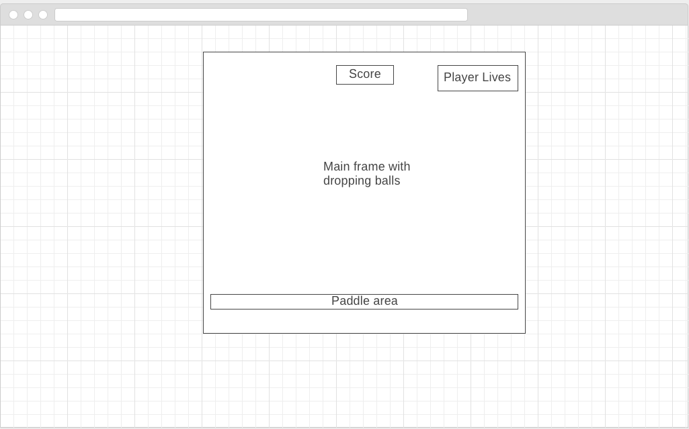

# Bounce

Bounce is a single-player game in which players juggle balls as they fall with increasing frequency. Think Brick Breaker without bricks.

## Functionality & MVP

- [ ] Balls will drop left, middle or right at different speeds
- [ ] Balls will increase in number as game goes on
- [ ] Players will be able to move paddle left or right with left and right arrow keys
- [ ] Players start with three lives
- [ ] Players will lose one life for each ball that is not blocked by paddle
- [ ] Game is over when players run out of lives
- [ ] Game will keep track of score based on number of balls hit
- [ ] Dropping bonus items will include a +1 life and 2x score
- [ ] Game will keep track of highest score
- [ ] Game will include sound effect for each time ball hits paddle
- [ ] Intro page will have instructions and play button
- [ ] Game over page will have high score, player score, and play again button

## Technologies

Bounce will employ vanilla JS, Canvas, and an audio library.

## Wireframes

## Implementation Timeline

### Phase 1 (Day 1):
- [ ] Movement of balls
- [ ] Random color generation for ball
- [ ] Player paddle and movement

### Phase 2 (Day 2):
- [ ] Increasing number of balls
- [ ] Scoring
- [ ] Life deduction
- [ ] Sound effect

### Phase 3 (Day 3):
- [ ] Bonus items (+1 life and 2x score)
- [ ] Intro page
- [ ] Game over page
